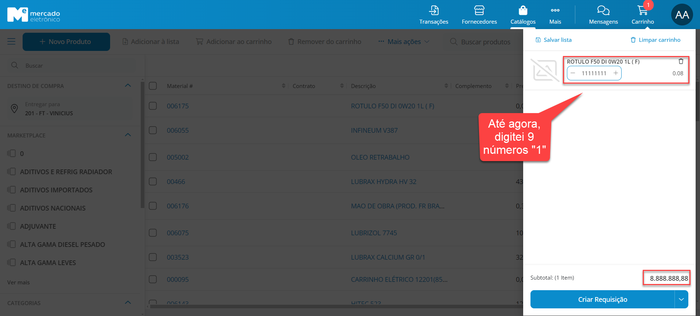
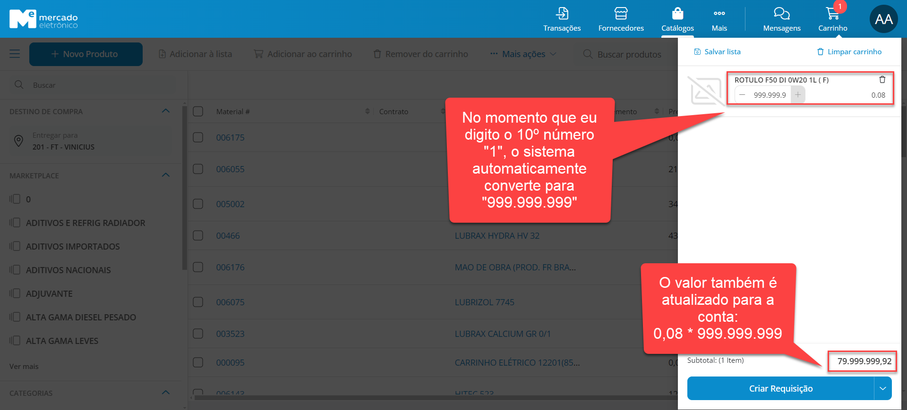
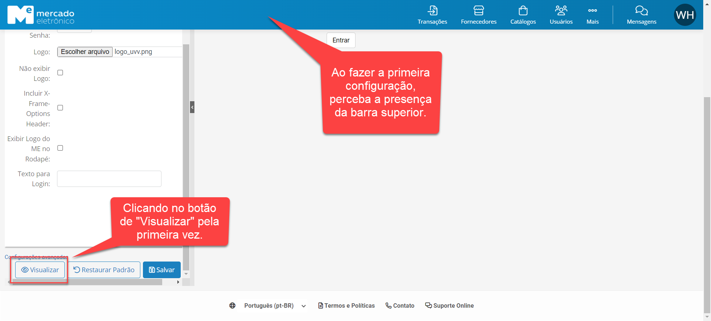
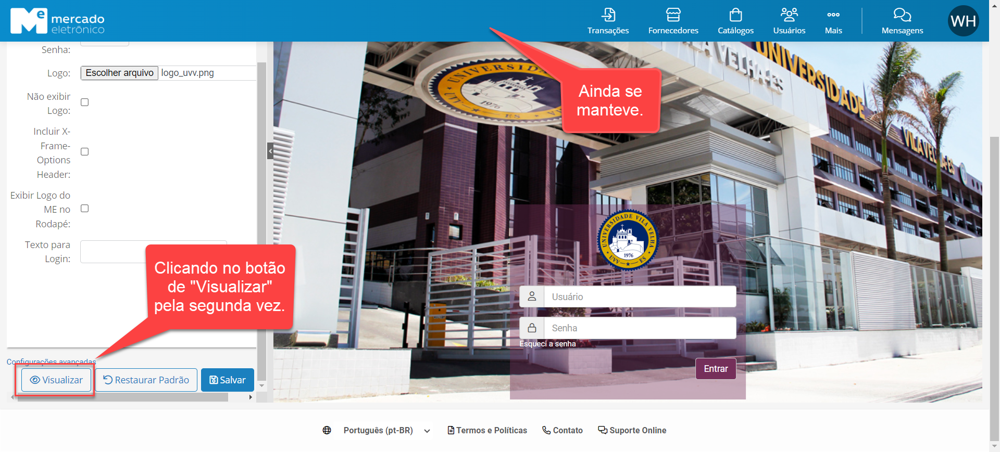
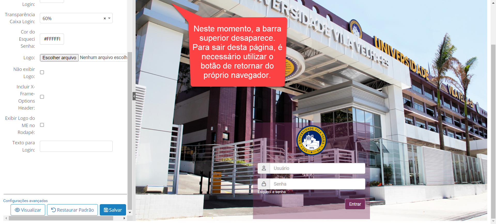

# 1 - Template de Reporte de Defeito

## 1.1 - Reporte do REQ-1:

- *Data de Identificação:* 09/05/2024
- *Descrição do Defeito:* Limite do Carrinho de Compras deveria ser maior
- *Nome do Sistema/Software:* Mercado Eletrônico
- *Ambiente:* STG (Testes)

- *Passos para Reproduzir o Defeito:*

1. Acessar o portal pelo Backoffice e substituir pelo usuário AA_ADM_TESTE;
2. Acessar a tela "Transações" e clicar em "+ Requisição Normal";
3. Selecionar um item e clicar em "Adicionar ao Carrinho";
4. Abra o carrinho e digite uma quantidade de 9 dígitos qualquer;
5. Agora, digite um décimo dígito;
6. **Resultado:** O portal mudará a quantidade automaticamente para 999.999.999.

- *Comportamento Esperado:*
A quantidade digitada deveria ser mantida e não alterada para uma limite.

- *Evidências do teste do REQ-1:*

## 1.2 - Reporte do REQ-2:

- *Data de Identificação:* 09/05/2024
- *Descrição do Defeito:* Verificar se manterá a barra superior de navegação
- *Nome do Sistema/Software:* Mercado Eletrônico
- *Ambiente:* STG (Testes)

- *Passos para Reproduzir o Defeito:*

1. Acessar o portal pelo Backoffice e substituir pelo usuário AA_ADM_TESTE;
2. Clicar em "... Mais", digitar "Personalizar Tela de Login" e clicar nessa opção;
3. Adicione qualquer imagem em "Imagem de Fundo" e em "Logo";
4. Clique em "Visualizar";
5. Repita os passos 3 e 4;
6. **Resultado:** Na segunda vez ao clicar no botão "Visualizar", a barra superior desaparece, impedindo o usuário de navegar pelo portal.

- *Comportamento Esperado:*
A barra superior não deveria desaparecer.

- *Evidências do teste do REQ-2:*

