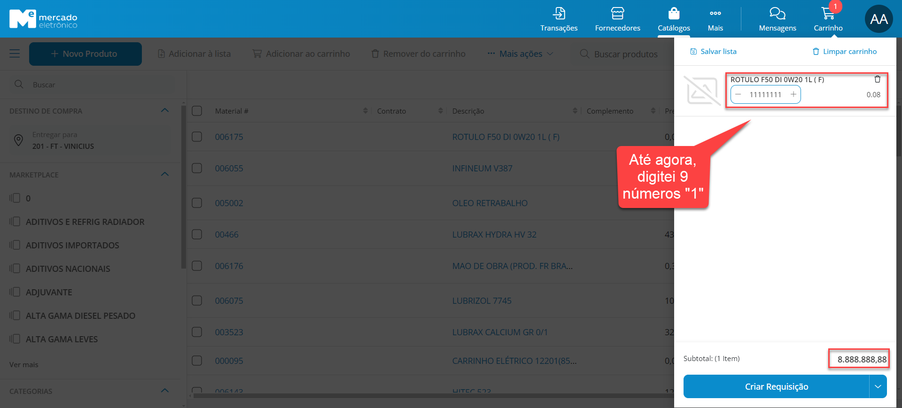
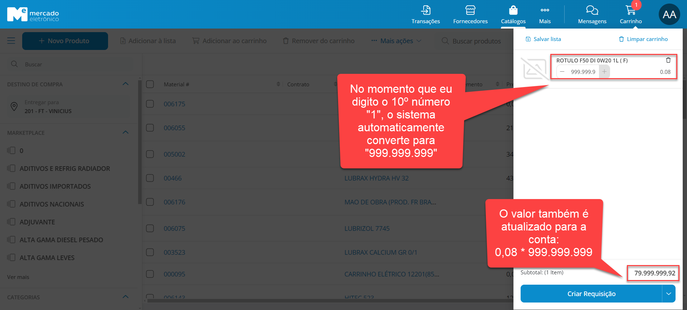
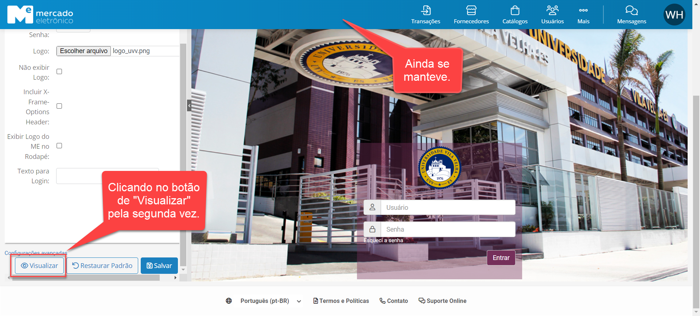
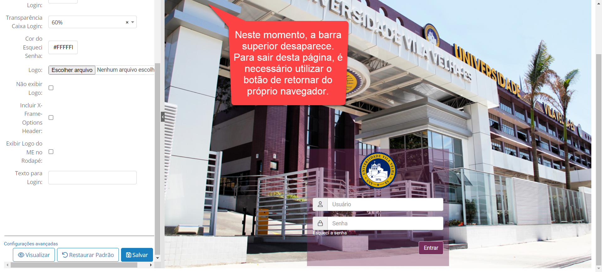

# 1 - Template de Reporte de Defeito

## 1.1 - Reporte do REQ-1:

- *Data de Identificação:* 09/05/2024
- *Descrição do Defeito:* Limite do Carrinho de Compras deveria ser maior
- *Nome do Sistema/Software:* Mercado Eletrônico
- *Ambiente:* STG (Testes)

- *Passos para Reproduzir o Defeito:*

1. Acessar o portal pelo Backoffice e substituir pelo usuário AA_ADM_TESTE;
2. Acessar a tela "Transações" e clicar em "+ Requisição Normal";
3. Selecionar o item "ROTULO F50 DI 0W20 1L(F)" e clicar em "Adicionar ao Carrinho";
4. Abra o carrinho e digite 111.111.111;
5. Agora, digite outro dígito "1";
6. **Resultado:** O portal mudará a quantidade automaticamente para 999.999.999.

- *Comportamento Esperado:*
A quantidade digitada deveria ser mantida e não alterada para uma limite.

- *Evidências:*

## 1.2 - Reporte do REQ-2:

- *Data de Identificação:* 09/05/2024
- *Descrição do Defeito:* Verificar se manterá a barra superior de navegação
- *Nome do Sistema/Software:* Mercado Eletrônico
- *Ambiente:* STG (Testes)

- *Passos para Reproduzir o Defeito:*

1. Acessar o portal pelo Backoffice e substituir pelo usuário AA_ADM_TESTE;
2. Clicar em "... Mais", digitar "Personalizar Tela de Login" e clicar nessa opção;
3. Adicione no campo "Logo" a imagem [Logo UVV](https://github.com/vinifrigulha/UVV/blob/main/Qualidade%20de%20Testes/images/testes/logo_uvv.png);
4. Adicione no campo "Imagem de Fundo" a imagem [Imagem de Fundo](https://github.com/vinifrigulha/UVV/blob/main/Qualidade%20de%20Testes/images/testes/wallpaper_uvv.png);
5. Clique em "Visualizar";
6. Repita os passos 3, 4 e 5;
7. **Resultado:** Na segunda vez ao clicar no botão "Visualizar", a barra superior desaparece, impedindo o usuário de navegar pelo portal.

- *Comportamento Esperado:*
A barra superior não deveria desaparecer.

- *Evidências:*

# 2 - Componentes

| Aluno                     | Professora                | Turma | Disciplina                     |
| ------------------------- | ------------------------- | ----- | ------------------------------ |
| Vinícius Frigulha Ribeiro | Gabriela Martins de Jesus | CC5N  | Qualidade e Testes de Software |

# 3 - Links do GitHub

Link da [parte 1](https://github.com/vinifrigulha/UVV/blob/main/Qualidade%20de%20Testes/projeto_parte1.md)

Link da [parte 2](https://github.com/vinifrigulha/UVV/blob/main/Qualidade%20de%20Testes/projeto_parte2.md)

Link da [parte 3](https://github.com/vinifrigulha/UVV/blob/main/Qualidade%20de%20Testes/projeto_parte3.md)
