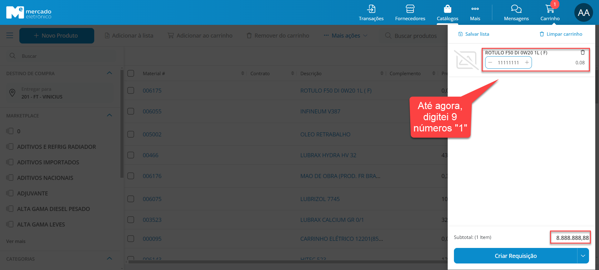

# Plano de Teste

## 1 - Introdução

Este documento descreve os requisitos a testar, os tipos de testes definidos para cada iteração e os recursos de hardware e software a serem empregados no sistema do Mercado Eletrônico.

Com esse documento, você conseguirá:

- Identificar informações de projeto existentes e os componentes de software que foram testados.
- Visualizar a listagem dos Requisitos testados.
- Listar os elementos resultantes do projeto de testes.

## 2 - Sobre o Mercado Eletrônico

O Mercado Eletrônico é uma empresa brasileira líder em soluções de comércio eletrônico B2B (business-to-business). Fundada em 1994, a empresa se destaca por oferecer uma plataforma robusta e abrangente para facilitar transações comerciais entre empresas.

A missão do Mercado Eletrônico é simplificar e otimizar as compras corporativas por meio de tecnologia avançada. Eles oferecem uma variedade de serviços e soluções para ajudar empresas de todos os portes a melhorar seus processos de compras, desde a busca por fornecedores até a gestão de contratos e pagamentos.

O Mercado Eletrônico tem sido reconhecido por sua inovação e compromisso em impulsionar a transformação digital no mercado B2B. Sua ampla experiência e presença no mercado brasileiro o tornam um parceiro confiável para empresas que buscam modernizar e aprimorar suas operações de compras e relacionamento com fornecedores.

## 3 - Requisitos de Teste

Esta seção contém os requisitos identificados como objetos dos testes ao longo do desenvolvimento do projeto.

| Requisito | Descrição                  |
| --------- | -------------------------- |
| REQ-1     | Carrinho de Compras        |
| REQ-2     | Personalizar Tela de Login |

## 4 - Testes

Esta seção é dedicada a apresentar os critérios de testes realizados em cada unidade do sistema do Mercado Eletrônico identificadas nos requisitos acima.

### 4.1 - Quantidade de Itens no Carrinho de Compra (REQ 1)

Durante os testes realizados, ao se tentar digitar uma quantidade com número de dígitos superior a 9, o sistema automaticamente converte a quantidade para 999.999.999 e bloqueia o acréscimo de novos dígitos, mantendo esse valor. Entretanto, ao navegar para a próxima tela, onde também é possível alterar a quantidade, foi observado o rompimento do limite do carrinho de compras.

 
<table>
    <tr>
        <th>
            Objetivo:
        </th>
        <th colspan="4">
            Verificar se há um limite de valor no carrinho de compras
        </th>
    </tr>
    <tr>
        <th>
            Técnica:
        </th>
        <th colspan="2">
            Manual (x) 
        </th>
        <th colspan="2">
            Automática ( ) 
        </th>
    </tr>
    <tr>
        <th>
            Abordagem:
        </th>
        <th colspan="2">
            Caixa branca ( )
        </th>
        <th colspan="2">
            Caixa preta (x)
        </th>
    </tr>
    <tr>
        <th>
            Estágio do teste:
        </th>
        <th>
            Integração ( )
        </th>
        <th>
            Sistema ( )
        </th>
        <th>
            Unidade (x)
        </th>
        <th>
            Aceitação ( )
        </th>
    </tr>
    <tr>
        <th>
            Responsável:
        </th>
        <th colspan="4">
            Vinícius Frigulha
        </th>
    </tr>
</table>

#### **Observação geral:**

_Ambiente de Teste:_ Os testes foram realizados em um ambiente de teste dedicado que replica as condições do ambiente de produção.

### 4.2 - Personalizar Tela de Login (REQ-2)

Durante os testes realizados, ao se clicar duas vezes no botão "Visualizar" na tela personalizar a tela de login, a barra superior de navegação desaparece, sendo necessário utilizar o botão de retorno do próprio navegador para retornar à tela anterior ou sair dessa tela de personalização.

 
<table>
    <tr>
        <th>
            Objetivo:
        </th>
        <th colspan="4">
            Verificar se manterá a barra superior de navegação
        </th>
    </tr>
    <tr>
        <th>
            Técnica:
        </th>
        <th colspan="2">
            Manual (x) 
        </th>
        <th colspan="2">
            Automática ( )
        </th>
    </tr>
    <tr>
        <th>
            Estágio do teste:
        </th>
        <th>
            Integração ( )
        </th>
        <th>
            Sistema ( )
        </th>
        <th>
            Unidade (x)
        </th>
        <th>
            Aceitação ( )
        </th>
    </tr>
    <tr>
        <th>
            Abordagem do teste:
        </th>
        <th colspan="2">
            Caixa branca ( )
        </th>
        <th colspan="2">
            Caixa preta (x)
        </th>
    </tr>
    <tr>
        <th>
            Responsável:
        </th>
        <th colspan="4">
            Vinícius Frigulha
        </th>
    </tr>
</table>

#### **Observação geral:**

_Ambiente de Teste:_ Os testes foram realizados em um ambiente de teste dedicado que replica as condições do ambiente de produção.

## 5 - Recursos

Esta seção descreve os recursos de ambiente de teste (hardware e software) necessários para execução dos testes que serão descritos nas subseções que seguem.

### 5.1 - Hardware

<table>
    <tr>
        <th>
        Modelo do Notebook:
        </th>
        <th>
        Dell Inspiron 15 5510
        </th>
    </tr>
    <tr>
        <th>
        Processador:
        </th>
        <th>
        Intel Core i5 11ª Geração 
        </th>
    </tr>
    <tr>
        <th>
        Memória RAM:
        </th>
        <th>
        16 GB 
        </th>
    </tr>
</table>

### 5.2 - Software

<table>
    <tr>
        <th colspan="3">
        Sistema Operacional:
        </th>
        <th colspan=3>
        Windows 11 Pro 64-bit
        </th>
    </tr>
    <tr>
        <th colspan=3>
        Navegador(es):
        </th>
        <th>
        Google Chrome (x)
        </th>
        <th>
        Microsoft Edge (x)
        </th>
        <th>
        Mozilla Firefox (x)
        </th>
    </tr>
</table>

## 6 - Níveis de Criticidades de Defeito

Dentro dos requisitos levantados anteriormente, temos as seguintes análises:

| REQ-1                                                                                                                                                                                                                                                                  | REQ-2                                                                                                                                                                                                                                                                                                                                                                                 |
| ---------------------------------------------------------------------------------------------------------------------------------------------------------------------------------------------------------------------------------------------------------------------- | ------------------------------------------------------------------------------------------------------------------------------------------------------------------------------------------------------------------------------------------------------------------------------------------------------------------------------------------------------------------------------------- |
| _GRAV-4_                                                                                                                                                                                                                                                               | _GRAV-5_                                                                                                                                                                                                                                                                                                                                                                              |
| Embora exija um cenário extremo, é importante para alguns clientes saberem o limite de unidades que eles podem adicionar ao carrinho de compras, ainda que eles possam alterar a quantidade na tela seguinte                                                           | Como é uma ferramenta utilizada mais na visão do administrador ou técnico e vai ser pouco utilizada, seu grau de criticidade é baixíssimo, mas não deixa de ser um ponto a melhorar                                                                                                                                                                                                   |
| Para grandes empresas de e-commerce como a Amazon, Shopee e outros, ter um limite de compra no carrinho de compras pode ser bastante crítico e ter impactos significativos nas operações e na experiência do cliente. Então seria algo entre os níveis GRAV-1 e GRAV-2 | Se a barra superior do LinkedIn desaparecesse em determinadas funcionalidades do site, impedindo o usuário de retornar à tela anterior ou acessar outras partes do portal, isso teria um impacto significativo na experiência do usuário e na funcionalidade do site. A falta da barra superior no LinkedIn em determinadas funcionalidades seria classificada com uma nota de GRAV-2 |

## 7 - SLA de Resolução

### SLA para o REQ-1:

1. **Tempo de Resolução:** A equipe de desenvolvimento se compromete a investigar e corrigir o problema de limite de quantidade no carrinho de compras dentro de 1 mês após a identificação do incidente.

2. **Prioridade do Incidente:** O problema será classificado como de baixa prioridade (GRAV-4), devido ao impacto direto na funcionalidade essencial de adicionar produtos ao carrinho de compras, mas por ser para cenários extremos.

3. **Atualização de Status:** A equipe de suporte informará o progresso da resolução do incidente a cada 1 semana até que o problema seja completamente resolvido.

4. **Compensação ao Cliente:** Se o problema não for resolvido dentro do prazo acordado, os clientes receberão um bônus no serviço contratado equivalente a 2% do valor acordado.

5. **Monitoramento Contínuo:** Após a resolução do incidente, o sistema será monitorado continuamente para garantir que o limite de quantidade no carrinho de compras funcione corretamente sem comprometer outras funionalidades.

### SLA para o REQ-2:

1. **Tempo de Resolução:** A equipe de desenvolvimento se compromete a investigar e corrigir o problema de desaparecimento da barra de navegação ao clicar duas vezes no botão "Visualizar" dentro de 1 mês após a identificação do incidente.

2. **Prioridade do Incidente:** O problema será classificado como prioridade muito baixa (GRAV-5), considerando que o acesso à navegação principal do site é comprometido, mas o acesso a essa funcionalidade é baixo.

3. **Atualização de Status:** A equipe de suporte informará o progresso da resolução do incidente a cada 2 semanas até que o problema seja completamente resolvido.

4. **Compensação ao Cliente:** Caso o problema persista além do prazo acordado, os clientes afetados receberão um bônus no serviço contratado equivalente a 0,5% do valor acordado.

5. **Testes de Validade:** Após a resolução do incidente, a equipe realizará testes adicionais para garantir que o botão "Visualizar" na tela de personalização de login não cause mais o desaparecimento da barra de navegação.

## 8 - Template de Reporte de Defeito

### 8.1 - Reporte do REQ-1:

- *Data de Identificação:* 09/05/2024
- *Descrição do Defeito:* Limite do Carrinho de Compras deveria ser maior
- *Nome do Sistema/Software:* Mercado Eletrônico
- *Ambiente:* STG (Testes)

- *Passos para Reproduzir o Defeito:*

1. Acessar o portal pelo Backoffice e substituir pelo usuário AA_ADM_TESTE;
2. Acessar a tela "Transações" e clicar em "+ Requisição Normal";
3. Selecionar um item e clicar em "Adicionar ao Carrinho";
4. Abra o carrinho e digite uma quantidade de 9 dígitos qualquer;
5. Agora, digite um décimo dígito;
6. **Resultado:** O portal mudará a quantidade automaticamente para 999.999.999.

- *Comportamento Esperado:*
A quantidade digitada deveria ser mantida e não alterada para uma limite.

- *Evidências do teste do REQ-1:*

### 8.2 - Reporte do REQ-2:

- *Data de Identificação:* 09/05/2024
- *Descrição do Defeito:* Verificar se manterá a barra superior de navegação
- *Nome do Sistema/Software:* Mercado Eletrônico
- *Ambiente:* STG (Testes)

- *Passos para Reproduzir o Defeito:*

1. Acessar o portal pelo Backoffice e substituir pelo usuário AA_ADM_TESTE;
2. Clicar em "... Mais", digitar "Personalizar Tela de Login" e clicar nessa opção;
3. Adicione qualquer imagem em "Imagem de Fundo" e em "Logo";
4. Clique em "Visualizar";
5. Repita os passos 3 e 4;
6. **Resultado:** Na segunda vez ao clicar no botão "Visualizar", a barra superior desaparece, impedindo o usuário de navegar pelo portal.

- *Comportamento Esperado:*
A barra superior não deveria desaparecer.

- *Evidências do teste do REQ-2:*

## 9 - Componentes

| Aluno                     | Professora                | Turma | Disciplina                     |
| ------------------------- | ------------------------- | ----- | ------------------------------ |
| Vinícius Frigulha Ribeiro | Gabriela Martins de Jesus | CC5N  | Qualidade e Testes de Software |
